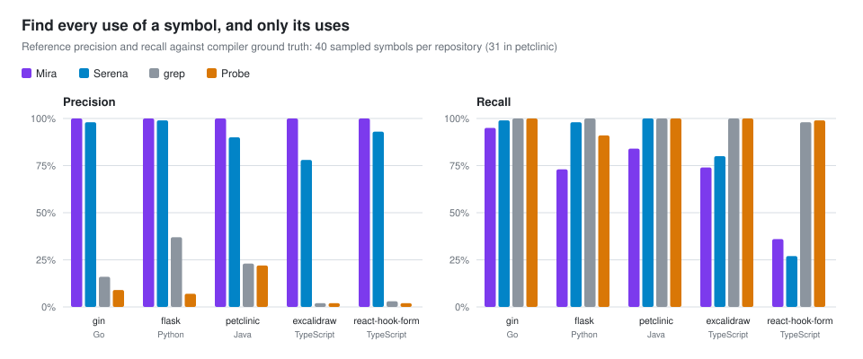
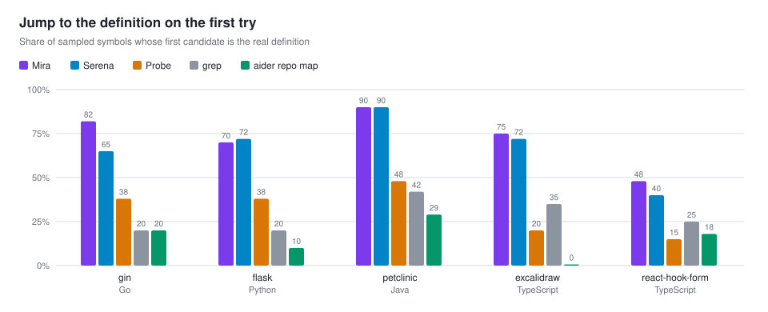
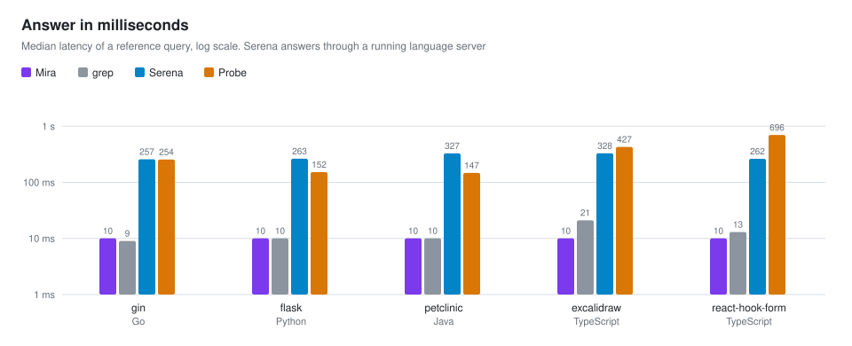
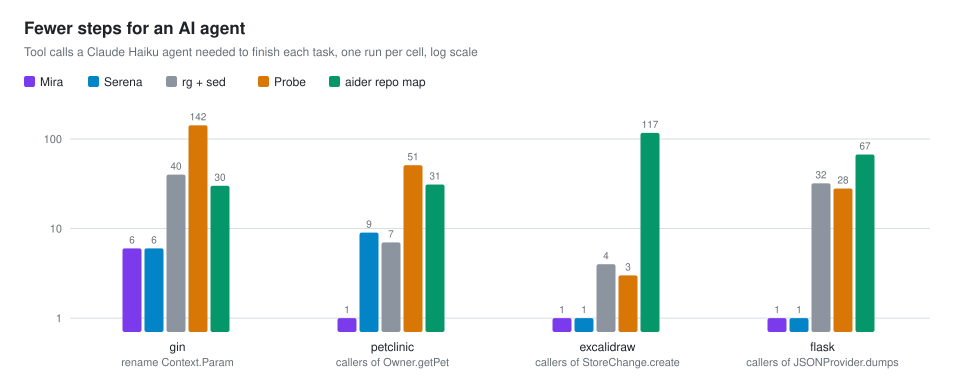
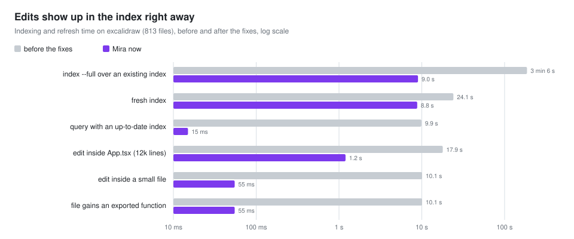

<h1 align="center">Mira</h1>

<p align="center">
  <b>Aim at the symbol. Read only what matters.</b><br>
  A local code index for AI agents: navigate by symbol, read code by line range, edit by symbol with verification.<br>
  One binary, CLI and MCP server.
</p>

<p align="center">
  <a href="https://github.com/JonathanSantos/mira/actions/workflows/ci.yml"></a>
  
  
  <a href="README.pt-BR.md"></a>
</p>

AI agents usually explore a repository with `ls`, `grep` and `cat`, reading whole files to find one
function. Mira indexes symbols, references and imports with tree-sitter into a local SQLite database
and answers with compact, line-numbered text: the definition, who calls it, what it calls, every use
with the method that contains it, or the structure of a long function. Nothing returns a whole file.

## What Mira is

- **A symbol index** for TypeScript, JavaScript, Java, Python and Go. Every query refreshes it first,
  incrementally, so edits show up in milliseconds.
- **A navigation API for agents**: definitions, callers and callees, references grouped by the
  enclosing method, a function skeleton (returns, throws, locals, what it uses), lexical search and
  snippets by line range.
- **A symbolic editor**: replace a definition, swap a snippet inside it, insert before or after, rename
  across files, delete. Each edit re-indexes and reports whether the references still resolve.
- **Honest about what it knows**: a reference it cannot pin to one definition is reported as
  `ambiguous` or `unresolved`, never guessed. In the benchmark below its reference precision is 100%
  in all five repositories.
- **One binary**: a CLI, an MCP server over stdio and an agent skill that teaches the workflow.

## What Mira is not

- **Not a compiler-precise code graph** like SCIP, Kythe, Glean or CodeQL. Resolution follows imports,
  declared types, inheritance and return types, but there is no type checker, so some uses stay
  unresolved. Tools backed by a language server find more of them in Go, Python and Java.
- **Not a language server**: no completion, diagnostics or data flow.
- **Not semantic search**: search is lexical, over identifiers, sub-tokens, strings and comments.
- **Not a hosted service**: it indexes one local checkout. Library code is opaque and marked `external`.

## Quick start

Mira needs Go 1.26+ and a C compiler, because the tree-sitter runtime is cgo.

```bash
go install github.com/JonathanSantos/mira/cmd/mira@latest

cd your-project
mira init      # creates .mira/ with the config and an empty index; add .mira/ to .gitignore
mira index     # first full index; later queries refresh incrementally
mira doctor    # checks the runtime, the index and the agent setup
```

Connect it to an agent:

```bash
claude mcp add mira -- mira mcp   # Claude Code; any MCP client can run `mira mcp`
mira skill --install              # writes .claude/skills/mira/SKILL.md for the agent
```

```json
{ "mcpServers": { "mira": { "command": "mira", "args": ["mcp"] } } }
```

## Examples

Real output on [gin](https://github.com/gin-gonic/gin): 122 files indexed in 0.9 s.

**What is this method and who calls it?**

```text
$ mira resolve Context.Param
Context.Param method context.go:513-515 [exported]
  func (c *Context) Param(key string) string
  513| func (c *Context) Param(key string) string {
  514| 	return c.Params.ByName(key)
  515| }
  callers (13):
    RouterGroup.createStaticHandler method routergroup.go:216-239
    TestRaceParamsContextCopy function context_test.go:3240-3259
    TestCreateTestContextWithRouteParams function context_test.go:3502-3514
    …
  callees (1):
    Params.ByName method tree.go:40-43
```

**Who uses this exact method in production code?** A qualified name keeps only the uses resolved to
that definition. On spring-petclinic, `name:line` picks one of three `getPet` overloads:

```text
$ mira refs Context.Param --exclude-tests
refs Context.Param: 1 total (resolved 1) by kind (method 1)
targets:
  Context.Param method context.go:513-515
routergroup.go (1)
  225 [method] in RouterGroup.createStaticHandler:216-239: file := c.Param("filepath")

$ mira refs Owner.getPet:126 --exclude-tests
refs Owner.getPet:126: 4 total (resolved 4) by kind (method 4)
targets:
  org.springframework.samples.petclinic.owner.Owner.getPet method src/main/java/org/springframework/samples/petclinic/owner/Owner.java:126-136
src/main/java/org/springframework/samples/petclinic/owner/PetController.java (2)
  86 [method] in PetController.findPet:75-87: return owner.getPet(petId);
  189 [method] in PetController.updatePetDetails:186-200: Pet existingPet = owner.getPet(id);
…
```

**What does a long function do, without reading all of it?**

```text
$ mira resolve Engine.handleHTTPRequest --include-skeleton
Engine.handleHTTPRequest method gin.go:690-760
  func (engine *Engine) handleHTTPRequest(c *Context)
  …
  skeleton: 71 lines, 13 branches, 2 loops
  returns (4):
    724 return
    729 return
    732 return
    754 return
  uses (same file):
    redirectTrailingSlash :781 (728)
    redirectFixedPath :808 (731)
    serveError :764 (753, 759)
  uses (other files):
    Context.Next context.go:198 (722)
    cleanPath path.go:23 (704)
    responseWriter.WriteHeaderNow response_writer.go:77 (723)
```

**Rename across files, touching only this method.** Other methods named `Param` are left alone, and
mentions in comments and docs are listed instead of changed:

```text
$ mira edit rename context.go Context.Param ParamV2 --preview
rename Context.Param -> ParamV2: 23 lines in 5 files (preview: nothing written)
context.go
  - 513| func (c *Context) Param(key string) string {
  + 513| func (c *Context) ParamV2(key string) string {
routergroup.go
  - 225| 		file := c.Param("filepath")
  + 225| 		file := c.ParamV2("filepath")
…
  note: 145 uses of Param resolve to other symbols or libraries and were left alone
  note: 17 mention(s) of Param in comments, strings or text files were not changed: BENCHMARKS.md:22, …
```

**Find a word anywhere**, with definitions first and comments marked:

```text
$ mira search ShouldBindJSON --exclude-tests --limit 6
context.go (10)
  D 890 in Context.ShouldBindJSON:890-892: func (c *Context) ShouldBindJSON(obj any) error {
  c 866: // ShouldBindJSON is a shortcut for c.ShouldBindWith(obj, binding.JSON).
  c 885: //	if err := c.ShouldBindJSON(&user); err != nil {
  …
```

## Benchmark

Mira was measured against [Serena](https://github.com/oraios/serena) (an MCP toolkit backed by language
servers), [Probe](https://github.com/probelabs/probe) (ripgrep plus tree-sitter), the
[aider](https://github.com/Aider-AI/aider) repository map and plain grep, on gin (Go), flask (Python),
spring-petclinic (Java), excalidraw and react-hook-form (TypeScript). References and definitions are
scored against compiler ground truths: `go/types`, the TypeScript checker, jedi and javac. The harness,
method and full tables are in [benchmark/](benchmark/README.md).

<picture>
  <source media="(prefers-color-scheme: dark)" srcset="docs/assets/references-dark.svg">
  
</picture>

Mira never reports a use that is not one. Serena finds more uses in Go, Python and Java, where its
language server resolves receivers that Mira leaves unresolved. In react-hook-form Mira leads on both.
grep and Probe find almost everything by matching text, and most of what they return is a homonym.

<picture>
  <source media="(prefers-color-scheme: dark)" srcset="docs/assets/definition-dark.svg">
  
</picture>

<picture>
  <source media="(prefers-color-scheme: dark)" srcset="docs/assets/latency-dark.svg">
  
</picture>

<picture>
  <source media="(prefers-color-scheme: dark)" srcset="docs/assets/agents-dark.svg">
  
</picture>

In the agent pilot every arm finished the gin rename and it compiled. The difference is the path: Mira
answered each impact task with a single call. Serena also needed one call in two tasks, but the agent
copied its zero-based line numbers and cited the wrong lines.

| | Mira | Serena | grep | Probe | aider repo map |
|---|---|---|---|---|---|
| Reference precision | 100% everywhere | 78–99% | 2–37% | 2–22% | – |
| Reference recall | 36–95% | 27–100% | 98–100% | 91–100% | – |
| Definition on the first candidate | 48–90% | 40–90% | 20–42% | 15–48% | 0–29% |
| Median latency per query | 10 ms | 240–340 ms | 9–22 ms | 163 ms–2 s | – |
| Setup on react (6,744 files) | 29 s index | 2.7 s start, 1–1.7 s per query | none | none | 54 s map |

<picture>
  <source media="(prefers-color-scheme: dark)" srcset="docs/assets/reindex-dark.svg">
  
</picture>

Limits of this round: 40 sampled symbols per repository, one agent run per cell with Claude Haiku, and
the other tools measured once. The charts are generated from the published tables with
`python3 benchmark/charts.py`.

## How it works

- **Parse**: tree-sitter extracts symbols, references and imports per file, in parallel, with one
  SQLite writer.
- **Resolve**: per-language rules link each reference to its definition through imports, re-exports,
  declared and inferred types, receivers, inheritance and overload arity. Each reference is recorded
  as `resolved`, `ambiguous`, `external` or `unresolved`.
- **Stay fresh**: every query runs an incremental refresh first. A rewritten file keeps the ids of the
  symbols it still declares, so only users of a symbol whose signature changed are resolved again.
- **Rebuild safely**: `mira index --full` builds a side database and swaps it in with the SQLite
  backup API. A reader, such as a running MCP server, sees the old index or the new one, never half.

## Commands

The MCP parameters and the CLI flags share names: `exclude_tests` is `--exclude-tests`.

| MCP tool | CLI | Answers |
|---|---|---|
| `list_files` | `mira files [path] --depth N --dirs-only` | where things are |
| `resolve_symbol` | `mira resolve <name>... --include-skeleton --include-body --include-refs` | what X is, its callers and callees |
| `find_references` | `mira refs <name\|Container.member[:line]>... --kind K --path P` | every use, with the enclosing method |
| `search_text` | `mira search <word> --regex --context N` | identifiers, strings, comments, text files |
| `list_symbols` | `mira symbols <file> --compact` | the outline of one file |
| `get_snippet` | `mira snippet <file> <start> <end>` | exact lines |
| `replace_symbol_body`, `replace_in_symbol` | `mira edit replace`, `mira edit replace-in` | edit a definition or a snippet inside it |
| `insert_before_symbol`, `insert_after_symbol` | `mira edit insert-before`, `mira edit insert-after` | add code next to a definition |
| `rename_symbol`, `delete_symbol` | `mira edit rename`, `mira edit delete` | rename across files, delete with a usage check |
| `index_status`, `reindex` | `mira status`, `mira index` | freshness and full rebuilds |

The complete CLI manual, in Portuguese, is in [docs/manual.pt-BR.md](docs/manual.pt-BR.md). The skill the
agent reads is [internal/skill/SKILL.md](internal/skill/SKILL.md).

## Development

```bash
make check                      # gofmt, go vet, golangci-lint and go test -race
make build                      # ./mira with the version embedded
python3 benchmark/charts.py     # regenerate the README charts from benchmark/results
```

Tagging `v*` builds release binaries for Linux, macOS and Windows. The field notes that shaped the
design are in [docs/field-test-2026-09-14.md](docs/field-test-2026-09-14.md), written when the project
was still called codegraph.

## License

[MIT](LICENSE)
